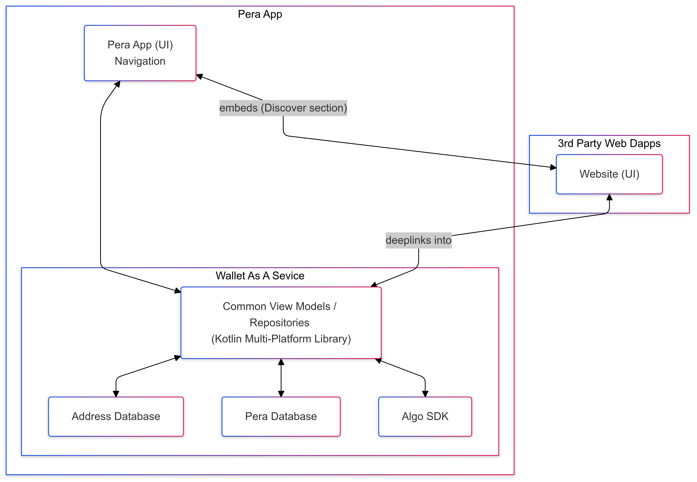
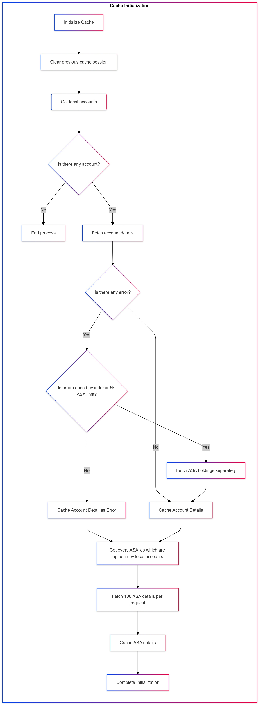
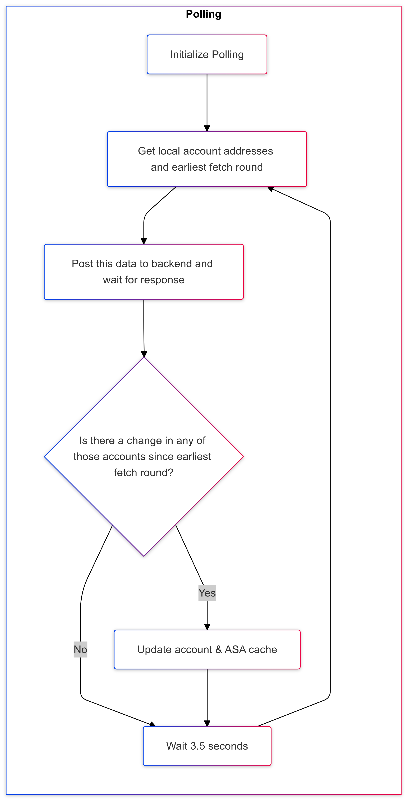
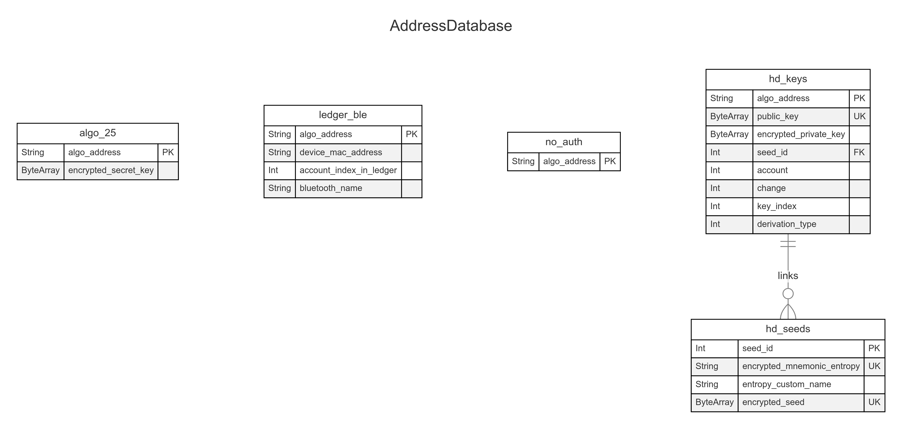
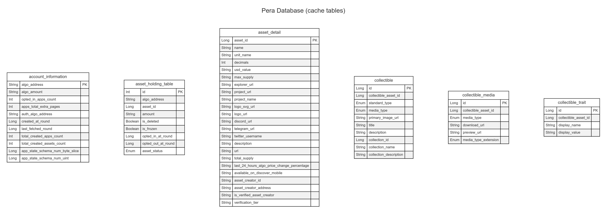

#### Common Wallet-SDK / Wallet-As-A-Service / Wallet Stack Proposed Architecture (WIP)

These diagrams are meant to be helpful and a WIP currently.  Eventually when we are ready, we will move them over to github wiki.

# App Layers




```sh
flowchart TD
    subgraph Pera App
    A("Pera App (UI)
    Navigation")
    A <--> D
        subgraph Wallet As A Sevice
        D("Common View Models / Repositories
        (Kotlin Multi-Platform Library)")
        E("Address Database")
        F("Pera Database")
        G("Algo SDK")
        D <--> E
        D <--> F
        D <--> G
        end
    end

    subgraph 3rd Party Web Dapps
    C("Website (UI)")
    C <-- deeplinks into --> D
    end

    A <-- embeds (Discover section) --> C
```

# Cache Initialization



```sh
flowchart TD
  subgraph ABC["**Cache Initialization**"]
    %% Nodes
    A[Initialize Cache]
    B[Clear previous cache session]
    C[Get local accounts]
    D[Is there any account?]
    E[End process]
    F[Fetch account details]
    G[Is there any error?]
    H[Is error caused by indexer 5k ASA limit?]
    I[Cache Account Details]
    J[Fetch ASA holdings separately]
    K[Cache Account Detail as Error]
    L[Get every ASA ids which are opted in by local accounts]
    M[Fetch 100 ASA details per request]
    N[Cache ASA details]
    O[Complete Initialization]

    %% Edge connections between nodes
    A --> B
    B --> C
    C --> D
    D -- No --> E
    D -- Yes --> F
    F --> G
    G -- Yes --> H
    G -- No --> I 
    H -- Yes --> J
    H -- No --> K
    J --> I
    K --> L
    I --> L
    L --> M
    M --> N
    N --> O

    %% Node Shapes
    D@{shape: diam}
    G@{shape: diam}
    H@{shape: diam}
  end
```

# Polling



```sh
flowchart TD
subgraph ABC["**Polling**"]
%% Nodes
    A("Initialize Polling")
    B("Get local account addresses and earliest fetch round")
    C("Post this data to backend and wait for response")
    D["Is there a change in any of those accounts since earliest fetch round?"]
    E("Update account & ASA cache")
    F("Wait 3.5 seconds")

%% Edge connections between nodes
    A --> B --> C --> D -- Yes --> E
    D -- No --> F
    E --> F
    F --> B

%% Node Shapes
    D@{shape: diam}
end
```

# Algorand Address Database




```sh
---
title: AddressDatabase
---
erDiagram
    algo_25 {
        String algo_address PK
        String encrypted_secret_key
    }
    ledger_ble {
        String algo_address PK
        String device_mac_address
        Int account_index_in_ledger
        String bluetooth_name
    }
    no_auth {
        String algo_address PK
    }
    hd_seeds {
        Int seed_id PK
        String encrypted_mnemonic_entropy UK
        String entropy_custom_name
        ByteArray encrypted_seed UK
    }
    hd_keys {
        String algo_address PK
        ByteArray public_key UK
        ByteArray encrypted_private_key
        Int seed_id FK
        Int account
        Int change
        Int key_index
        Enum derivation_type
    }
    hd_keys ||--o{ hd_seeds : links
```

# Pera Database




```sh
---
title: Pera Database (cache tables)
---
erDiagram
    account_information {
        String algo_address PK
        String algo_amount
        Int opted_in_apps_count
        Int apps_total_extra_pages
        String auth_algo_address
        Long created_at_round
        Long last_fetched_round
        Int total_created_apps_count
        Int total_created_assets_count
        Long app_state_schema_num_byte_slice
        Long app_state_schema_num_uint
    }
    asset_holding_table {
        Int id PK
        String algo_address
        Long asset_id
        String amount
        Boolean is_deleted
        Boolean is_frozen
        Long opted_in_at_round
        Long opted_out_at_round
        Enum asset_status
    }
    asset_detail {
        Long asset_id PK
        String name
        String unit_name
        Int decimals
        String usd_value
        String max_supply
        String explorer_url
        String project_url
        String project_name
        String logo_svg_url
        String logo_url
        String discord_url
        String telegram_url
        String twitter_username
        String description
        String url
        String total_supply
        String last_24_hours_algo_price_change_percentage
        String available_on_discover_mobile
        String asset_creator_id
        String asset_creator_address
        String is_verified_asset_creator
        String verification_tier
    }
    collectible {
        Long id PK
        Long collectible_asset_id
        Enum standard_type
        Enum media_type
        String primary_image_url
        String title
        String description
        Long collection_id
        String collection_name
        String collection_description
    }
    collectible_media {
        Long id PK
        Long collectible_asset_id
        Enum media_type
        String download_url
        String preview_url
        Enum media_type_extension
    }
    collectible_trait {
        Long id PK
        Long collectible_asset_id
        String display_name
        String display_value
    }
```
